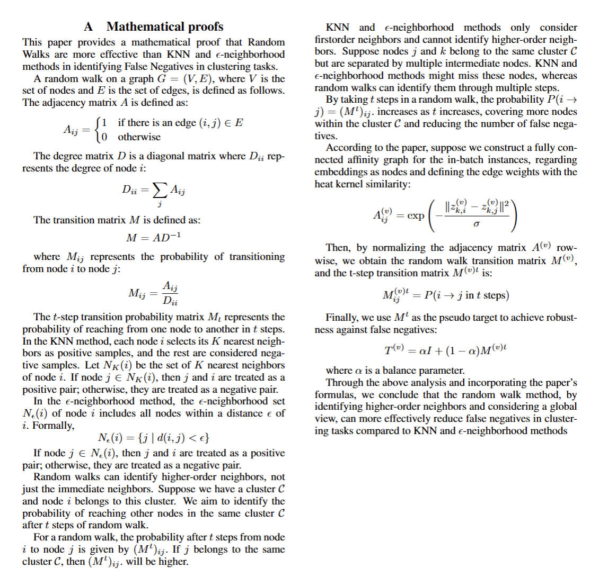
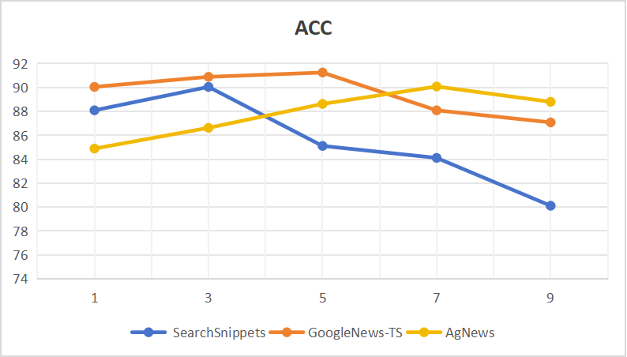
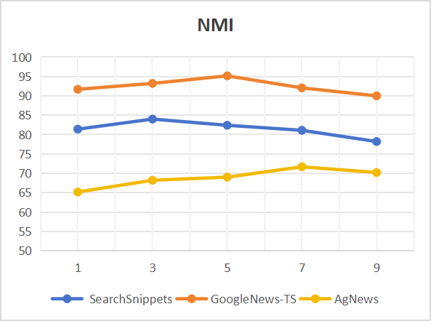
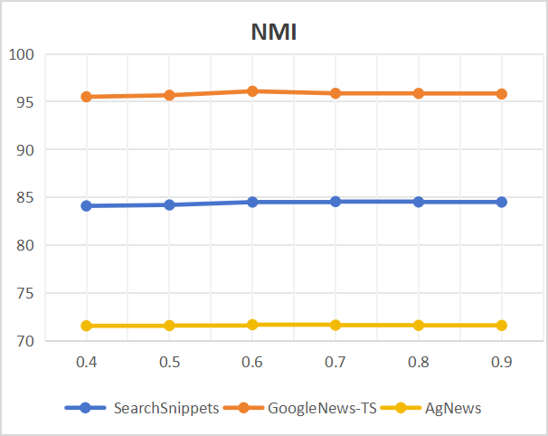

#  the code is https://github.com/2251821381/DCTC/tree/master
## Mathematical proofs(why DCTC is better )

# Parameter analysis of contrastive learning

In this section, we investigate the influence of hyperparameters on the model, including the loss balance factor ($\lambda$) and the temperature coefficient ($\tau$) for contrastive learning. 

## Temperature Coefficient ($\tau$)

In our experiment, we directly set the value of the temperature coefficient $\tau_C$ for the two contrastive learning components equal to $\tau_I$, and then change the temperature coefficient of contrastive learning. The value of $\tau$ is selected from \{0.4, 0.5, 0.6, 0.7, 0.8, 0.9\}, and experiments are conducted on three datasets. The results are reported in **Figure 5(a)** and **Figure 5(b)**. We observe that a suitable temperature coefficient gives a slight boost to the clustering effect of the model.

## Loss Balance Factor ($\lambda$)

Additionally, we set different values of $\lambda$ from \{1, 3, 5, 7, 9\}, and the experimental results are shown in **Figure 5(c)** and **Figure 5(d)**. As $\lambda$ increases, although the three datasets show completely different results in terms of ACC and NMI evaluation, the general trend is as follows: 

1. Performance improves with the increase of $\lambda$.
2. Performance stabilizes after $\lambda$ reaches a certain value.
3. Performance decreases when $\lambda$ becomes too large.

This is consistent with our experience: when $\lambda$ is too small, the learning ability of the decoupled-level contrastive learning head is not fully utilized. On the other hand, when $\lambda$ is too large, the ability of cluster-level contrastive learning is inhibited, which reduces the clustering performance.

  
  

  
  

