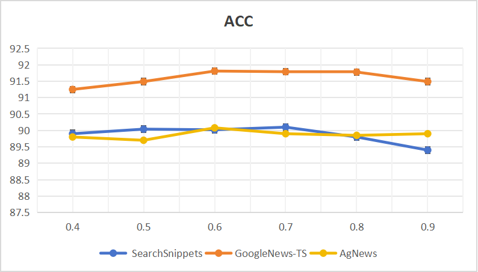

#  the code is https://github.com/2251821381/DCTC/tree/master
## Mathematical proofs(why DCTC is better )

# Parameter analysis of contrastive learning

In this section, we investigate the influence of hyperparameters on the model, including the loss balance factor ($\lambda$) and the temperature coefficient ($\tau$) for contrastive learning. 

### Temperature Coefficient ($\tau$)

In our experiment, we directly set the value of the temperature coefficient $\tau_C$ for the two contrastive learning components equal to $\tau_I$, and then change the temperature coefficient of contrastive learning. The value of $\tau$ is selected from \{0.4, 0.5, 0.6, 0.7, 0.8, 0.9\}, and experiments are conducted on three datasets. The results are reported in **Figure 5(a)** and **Figure 5(b)**. We observe that a suitable temperature coefficient gives a slight boost to the clustering effect of the model.

### Loss Balance Factor ($\lambda$)

Additionally, we set different values of $\lambda$ from \{1, 3, 5, 7, 9\}, and the experimental results are shown . As $\lambda$ increases, although the three datasets show completely different results in terms of ACC and NMI evaluation, the general trend is as follows: 

1. Performance improves with the increase of $\lambda$.
2. Performance stabilizes after $\lambda$ reaches a certain value.
3. Performance decreases when $\lambda$ becomes too large.

This is consistent with our experience: when $\lambda$ is too small, the learning ability of the decoupled-level contrastive learning head is not fully utilized. On the other hand, when $\lambda$ is too large, the ability of cluster-level contrastive learning is inhibited, which reduces the clustering performance.

  
  

  
  

# More detailed implementation guidelines

| Configure                    | Value      |
|------------------------------|------------|
| Optimizer                    | Adam       |
| Batch size                   | 1024       |
| Learning rate                | 1e-5       |
| Total training epoch         | 200        |

The target encoder parameters are updated using Exponential Moving Average (EMA) of the online encoder. The update rule is:

$\theta_k(v) \leftarrow m \cdot \theta_k(v) + (1 - m) \cdot \theta_q(v)$

where `m ∈ (0, 1]` is a fixed momentum coefficient during training. We set `m = 0.98` in our experiments.

# The the time complexity of the high-order random walk part:

### **step1: Similarity Graph Construction**

A fully connected similarity graph is constructed where the embeddings of the batch are treated as graph nodes. The edge weights between nodes are computed using a Gaussian kernel similarity function:

Where, $A_{ij}$ is the edge weight between nodes $i$ and $j$. $z_{k,i}$ is the embedding representation of node $i$. $\sigma$ is a hyperparameter controlling the scale of the distance. The similarity graph transforms sample embeddings into a graph structure, enabling the application of random walks. The edge weights represent the similarity between samples, where higher weights indicate greater similarity. Every sample is connected to all others, ensuring global information is captured. The computing pairwise similarities for all nodes requires $O(N^2 \cdot d)$.

### step2:Normalizing the Adjacency Matrix

The adjacency matrix $A$ is normalized to generate a transition matrix $M$: $$M = A D^{-1}$$, Where $D^{-1}$ is the inverse degree matrix, a diagonal matrix where $D_{ii} = \sum_j A_{ij}$. Calculating $D$ requires summing each row of $A$, which takes $O(N^2)$ time for $N$ rows.  $D^{-1}$ is the inverse of the diagonal matrix $D$. Each diagonal entry is simply inverted, which requires $O(N)$. Multiplying $A$ (a dense matrix) with $D^{-1}$ (a diagonal matrix) can be done element-wise, with a complexity of $O(N^2)$.

### step3: Multi-Step Random Walk Probability

The probability distribution $p(t)$at step $t$ is computed recursively using the random walk transition matrix $M$:

$p(0)$ is the initial probability distribution of the random walk, which is usually a one-hot vector for starting from a specific anchor node. $M_t$ is the $t$-th power of the transition matrix $M$.  Initialize Transition Matrix $M$:$M$ is computed as $M = A D^{-1}$, with a complexity of $O(N^2)$.  Recursive Matrix Multiplication: The $t$-step transition matrix $M^t$ is computed recursively: $M^t = M \cdot M \cdot M \cdots \quad (t \text{ multiplications})$ Each matrix multiplication $M \cdot M$ has a complexity of $O(N^3)$ for a dense $N \times N$ matrix.

### **step4: Generating Pseudo-Target Labels**

Pseudo-target labels $T$ are generated using the multi-step random walk results:

Where, $I$ is the identity matrix, ensuring self-loops are emphasized. $\alpha$ is a balancing parameter controlling the influence of random walks. Purpose: $T$ adjusts relationships between samples to reduce false negatives (within-cluster samples misclassified as negative) and false positives (between-cluster samples misclassified as positive). High-Order Neighbors: By incorporating $M^t$, the pseudo-labels capture high-order neighbor relationships. Constructing $T$ from $M^t$ requires $O(N^2)$, as it involves element-wise matrix operations.

### Total Complexity:

